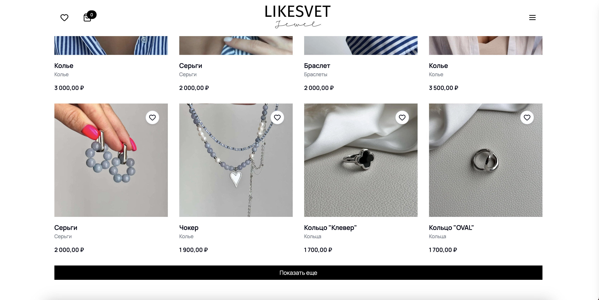
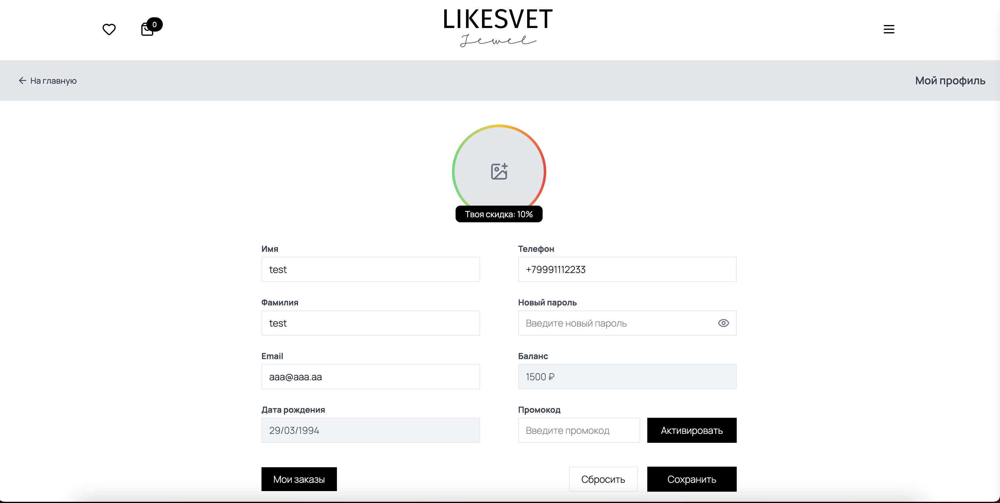
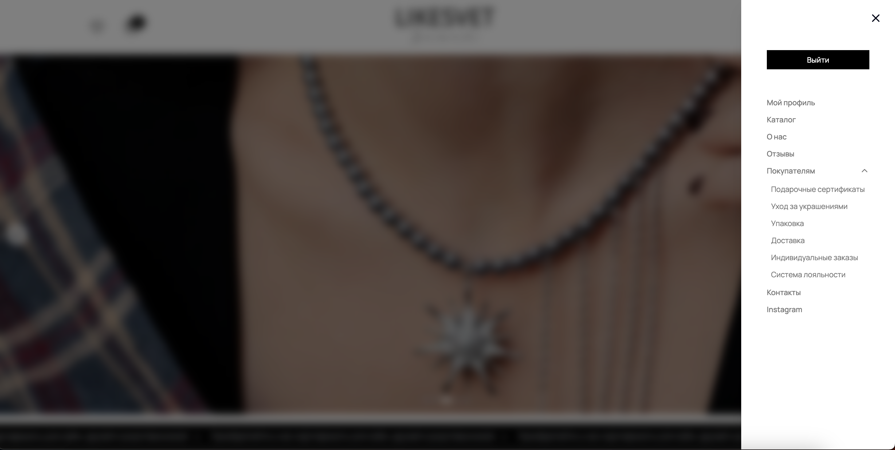
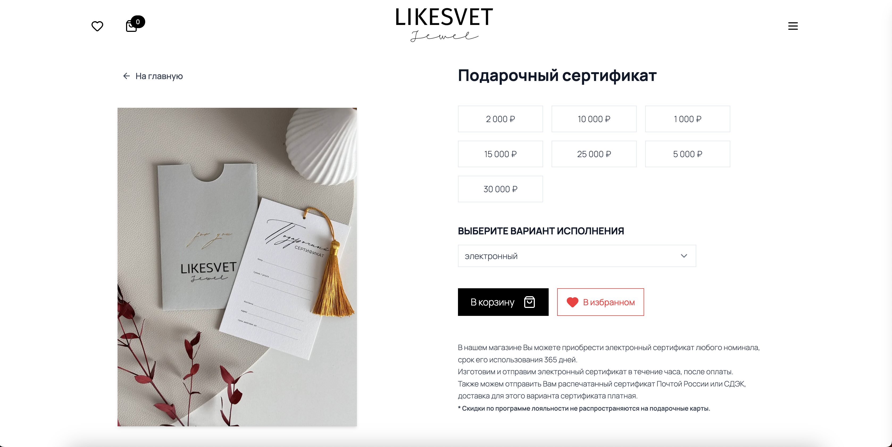
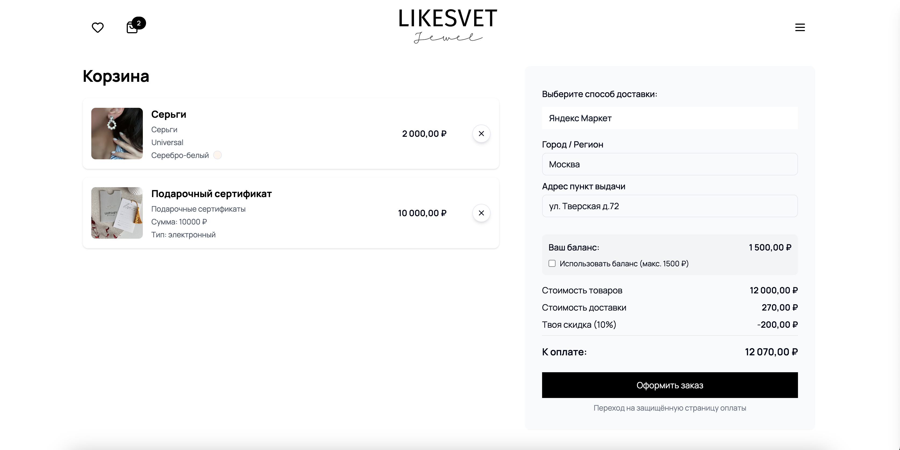

# 🌐 Like Svet

**Like Svet** — современная платформа интернет-магазина, интегрированная с CMS.
Сайт обеспечивает удобный и быстрый опыт для пользователей, делая покупки простыми и безопасными.

---

## 🛍️ Каталог и покупки

* 🔹 **Каталог товаров:** отображение всех доступных товаров с подробной информацией.
* 🔹 **Фильтры:** по категории, размеру, цвету и цене.
* 🔹 **Корзина и оформление заказа:** покупки доступны только для зарегистрированных пользователей. В корзине присутствует **автоматический калькулятор стоимости доставки**.
* 🔹 **Система промокодов:** пользователи могут применять промокоды для скидок.
* 🔹 **Платежи:** все платежи через **Alfa Bank** 




---

## 👤 Аккаунт пользователя

* Просмотр профиля и личной информации
* История заказов и статус текущих заказов
* Возможность редактирования данных



---

## 🧭 Навигация и ссылки

* В навигационной панели доступны полезные ссылки:

  * Уход за украшениями
  * Информационные страницы: доставка, контакты, упаковка, программа лояльности, персональные заказы



---

## 🖥️ Технологии

* **Frontend:** React + Next.js
* **Backend:** Node.js
* **База данных:** MongoDB
* **Аутентификация:** JWT (JSON Web Token)
* **Стили:** Tailwind CSS

---

## 🚀 Установка и запуск

1. Клонируйте репозиторий:

```bash
git clone https://github.com/your-username/like-svet-site.git
cd like-svet-site
```

2. Установите зависимости:

```bash
npm install
```

3. Запустите сервер разработки:

```bash
npm run dev
```

4. Перейдите в браузере по адресу:
   [http://localhost:3000](http://localhost:3000)

---

## 📩 Контакты

* **Автор:** Antipin Vladimiro
* **Email:** [antipinvladimiro@yandex.ru](mailto:antipinvladimiro@yandex.ru)

---

## 📷 Скриншоты (пример)

* Каталог товаров 
* Страница товара 
* Аккаунт пользователя 
* Корзина и оформление заказа 